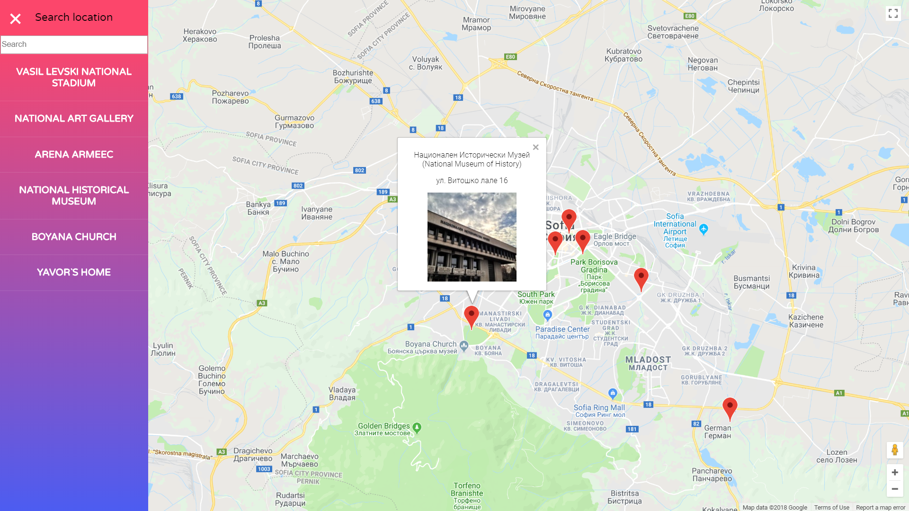

# Neighborhood-Map

This is the final project of Udacity Nanodegree program. The main goal is to develop a single page application featuring a map of my neighborhood or a neighborhood I would like to visit. This project gives me a strong knowledge of ReactJS, it learns me how to implement third-party APIs and how important is asynchronous programming.

## Instalation

* clone the repository
* open the folder in a terminal
* install all project dependencies with `npm install`
* start the development server with `npm start`

## Dependencies

* [create-react-app](https://github.com/facebook/create-react-app)
* [google-maps-react](https://github.com/fullstackreact/google-maps-react)
* [Foursquare API](https://foursquare.com/)
* [Google Maps JavaScript API](https://developers.google.com/maps/documentation/javascript/tutorial)

